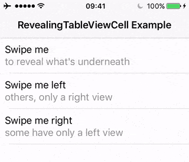
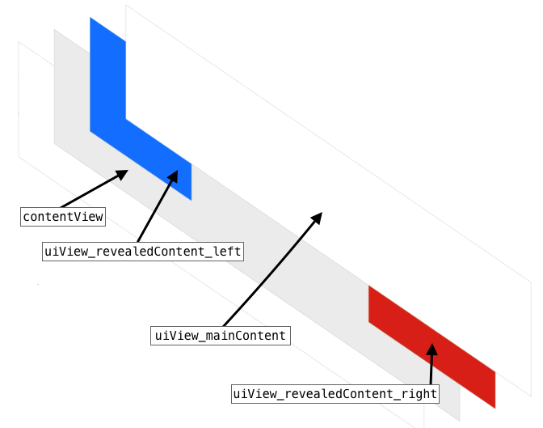
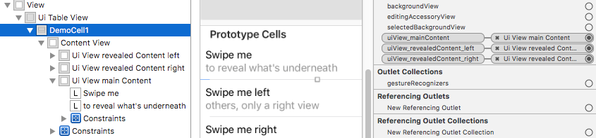

# RevealingTableViewCell

[](https://travis-ci.org/sovata8/RevealingTableViewCell/)
[](https://swift.org/)
[][linkMITLicence]
<a href="#documentation"></a> 
[][linkPod]
[][linkCarthage]

---

<p align="center">
    <a href="#what-is-it">What is it?</a>
    &bull;
    <a href="#check-it-out">Check it out</a>
    &bull;
    <a href="#installation">Installation</a>
    &bull;
    <a href="#usage">Usage</a>
    &bull;
    <a href="#documentation">Documentation</a>
</p>

#

## What is it?
`RevealingTableViewCell` is a `UITableViewCell` that can be swiped to reveal content underneath its main view.  

* Zero-code setup: `RevealingTableViewCell` can be set up through Interface Builder, with no code changes.
* 'Bring your own views' - Note that `RevealingTableViewCell` does not provide anything other than the sliding view - it's up to you to set up any views that need be revealed, e.g. buttons etc.)

<br/>
<p align="center"></p>


## Check it out

### CocoaPods
```bash
pod try RevealingTableViewCell
```
(this command clones the example project in a temporary folder and opens it in Xcode)

### Directly from the repo
Clone or download this repository and then open `Example/RevealingTableViewCellExample.xcodeproj`.

### Demo video
<a href="http://www.youtube.com/watch?feature=player_embedded&v=6Dvg48Mb0Nc
" target="_blank"></a>

(opens in YouTube)

## Installation
Requires min: `Swift 3`, `iOS 10`


#### [CocoaPods][linkPod] (recommended)

```ruby
pod 'RevealingTableViewCell'
```

#### [Carthage][linkCarthage]
````
github "sovata8/RevealingTableViewCell"
````


## Usage
No code changes required, everything is done in Interface Builder.  
Note that this framework does not provide anything other than the sliding view - it's up to you to set up any views that need be revealed (e.g. buttons, additional information etc.).


These screenshots show how to set up your views and IBOutlets:

#

<p align="center"></p>

#

<p align="center"></p>

#

### Step 1
Use `RevealingTableViewCell` (or your subclass of it) as a custom class for your tableview cell in Interface Builder.

### Step 2
Inside the cell's default `contentView`, put a subview and connect it to the the `IBOutlet` `uiView_mainContent`. This will be the view that slides sideways to reveal some content underneath. Using AutoLayout, pin this `uiView_mainContent` to it's superview (the `contentView`) using the following constraints:  

`uiView_mainContent.centerX = superview.centerX`
`uiView_mainContent.width = superview.width`
`uiView_mainContent.height = superview.height`
`uiView_mainContent.centerY = superview.centerY`

(or instead of the `height` and `centerY` constraints, you can use `top` and `bottom` constraints)


### Step 3
Inside the cell's default `contentView`, put and connect `uiView_revealedContent_left` and/or `uiView_revealedContent_right` subviews. Pin them using AutoLayout to the corresponding sides of your cell. Fix their widths. Make sure they are behind the `uiView_mainContent`.

### Step4
That's all - run your app!


### Making the cells close when needed <small>(optional)</small>
Usually, you would want cells to automatically close whenever you scroll the tableview, or when another cell is swiped sideways. To achieve this, use the provided tableview extension function `closeAllCells(exceptThisOne:)`. Here is an example (from the example project):

```swift
// Close all cells when the tableview starts scrolling vertically
extension ViewController: UIScrollViewDelegate
{
    func scrollViewDidScroll(_ scrollView: UIScrollView)
    {
        self.uiTableView.closeAllCells()
    }
}
```
  
```swift
// Close all other cells when a particular cell starts being swiped
extension ViewController: RevealingTableViewCellDelegate
{
    func didStartPanGesture(cell: RevealingTableViewCell)
    {
        self.uiTableView.closeAllCells(exceptThisOne: cell)
    }
}
```
(of course when you are creating the cell in your `cellForRowAt indexPath` logic, don't forget to set the delegate like this: `cell.revealingCellDelegate = self`)


## Documentation
Check out the auto-generated [Documentation](docs/Classes/RevealingTableViewCell.html).  
(If you're reading this on GitHub, and the above link opens the html source, try [this](https://github.com/sovata8/RevealingTableViewCell/tree/master/docs/Classes/RevealingTableViewCell.html))

## Used by

<a href='https://pivotlistapp.com/' target="\_parent"></a>  
<big>[PivotList](https://pivotlistapp.com/)</big>

Please let me know if you use `RevealingTableViewCell` in your app and would like to be mentioned here. (either email me or create e new issue with the "usedby" label)

## Known limitations and considerations
The way this library works requires that all the 'hidden' views (the ones that are behind the main view and are revealed when sliding), are in the view hierarchy of the cell at all times, even if they are never shown. This is obviously not great when performance matters.


[linkDocumentation]:http://cocoadocs.org/docsets/RevealingTableViewCell
[linkPod]:https://cocoapods.org/pods/RevealingTableViewCell
[linkMITLicence]:http://opensource.org/licenses/MIT
[linkCarthage]:https://github.com/Carthage/Carthage


## License
This project is licensed under the terms of the MIT license. See the [LICENSE](LICENSE) file.
